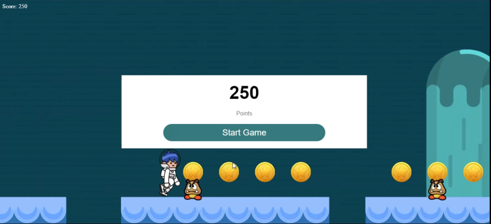

<h1>Mario Game</h1>
#

Mario Platform Game Using Canvas and Vanilla JavaScript

Mario jumps, runs, and walks across each level. 
The worlds are full of enemies and platforms, and open holes.

<a href="https://mo0hamedradwan.github.io/Mario-Game">Play Game</a>

## Getting Started

1.  Clone the repo:

        git clone https://github.com/mo0hamedRadwan/Mario-Game.git

2.  Install dependencies:

        yarn

    or

        npm install

3.  Run webpack:

        npm start

Your game should open up automatically at http://localhost:3000
